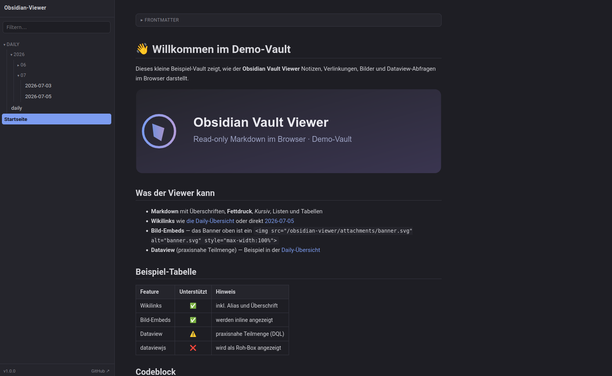

# Obsidian Vault Viewer

Ein schlanker, **read-only** Web-Viewer für ein [Obsidian](https://obsidian.md)-Vault
— ein einzelnes PHP-Skript, das Markdown-Notizen inklusive Wikilinks, Embeds und
einer Teilmenge von [Dataview](https://github.com/blacksmithgu/obsidian-dataview)
im Browser darstellt. Gedacht für den schnellen Zugriff auf das eigene
Vault von Geräten, auf denen Obsidian nicht installiert ist.

## Features

- **Markdown-Rendering** über [Parsedown](https://github.com/erusev/parsedown)
  (Tabellen, Codeblöcke, Blockquotes, Bilder)
- **Obsidian-Wikilinks**: `[[Notiz]]`, `[[Notiz|Alias]]`, `[[Notiz#Überschrift]]`
  mit Auflösung über vollen Pfad und Basename
- **Embeds**: `![[bild.png]]` wird inline dargestellt
- **Frontmatter** wird als aufklappbare Box angezeigt
- **Dataview (Teilmenge)**: `TABLE`/`LIST` mit `WHERE`, `SORT`, `LIMIT`,
  `dateformat()`, `file.*`-Feldern und Frontmatter (siehe unten)
- **Navigationsbaum** mit Live-Filter; nur der Pfad zur aktuellen Notiz ist aufgeklappt
- **Saubere URLs** via `mod_rewrite` (optional abschaltbar)
- **Responsive** inkl. Mobil-Menü, dezentes Dark-Theme
- Zugriffsschutz über **Apache Basic Auth** (`.htaccess`)

## Screenshot



## Voraussetzungen

- PHP 7.4 oder neuer (`mbstring` empfohlen, Fallback ist eingebaut)
- Apache mit `mod_auth_basic`; für saubere URLs zusätzlich `mod_rewrite`
  und `AllowOverride` für das Verzeichnis

## Installation

1. Repository auf den Webspace klonen bzw. kopieren, z. B. nach `/obsidian-viewer/`.
2. `config.example.php` nach `config.php` kopieren und anpassen
   (Titel, URL-Modus — siehe [Konfiguration](#konfiguration)).
3. `.htaccess.example` nach `.htaccess` kopieren und Zugriffsschutz einrichten
   (siehe [Sicherheit](#sicherheit)).
4. Unterordner `vault/` anlegen — dorthin kommt der Vault-Inhalt (siehe [Synchronisation](#synchronisation)).
5. Im Browser aufrufen.

## Konfiguration

Alle Einstellungen stehen in `config.php` (Vorlage: `config.example.php`):

| Option         | Typ    | Standard | Bedeutung |
|----------------|--------|----------|-----------|
| `SITE_TITLE`   | string | `Vault`  | Titel in Kopfzeile und Browser-Tab |
| `VAULT_DIR`    | string | `vault`  | Pfad zum Vault-Ordner: relativ zum Viewer oder absolut |
| `HOME`         | string | `''`     | Startseite (vault-relativer Pfad); leer = automatisch erkennen |
| `REWRITE_URLS` | bool   | `true`   | `true`: saubere URLs via `mod_rewrite`; `false`: Fallback über `?p=` |

### URL-Modus

Bei `REWRITE_URLS = true` erzeugt der Viewer Links wie
`./obsidian-viewer/20 Journal/daily/2026-07-30.md`. Ist `mod_rewrite` auf dem
Server nicht verfügbar, genügt `REWRITE_URLS = false` — dann werden Links über
`./index.php?p=...` erzeugt, ganz ohne Rewrite-Regeln.

## Sicherheit

Der Zugriffsschutz liegt vollständig in `.htaccess` (Apache Basic Auth); es gibt
bewusst keinen PHP-Login.

1. `.htaccess.example` nach `.htaccess` kopieren und darin den **absoluten Pfad**
   bei `AuthUserFile` eintragen.
2. Passwortdatei erzeugen:
   ```bash
   htpasswd -c /absoluter/pfad/zu/obsidian-viewer/.htpasswd benutzer
   ```
   Ohne `htpasswd` zur Hand, lokal einen Hash erzeugen:
   ```bash
   openssl passwd -apr1
   # Ausgabe als Zeile "benutzer:$apr1$…" in .htpasswd schreiben
   ```

Die mitgelieferte `.htaccess` sperrt zusätzlich den direkten HTTP-Zugriff auf den
`vault/`-Ordner, sodass rohe `.md`-Dateien nur über den Viewer erreichbar sind.

> Bei Installation in einem Unterordner ggf. `RewriteBase` in der `.htaccess` an
> den tatsächlichen Pfad anpassen. Verlangt der Server `mod_rewrite`, muss
> `Options +FollowSymLinks` (oder `+SymLinksIfOwnerMatch`) gesetzt sein.

## Synchronisation

Der Viewer liest nur — der Vault-Inhalt wird von außen in `vault/` gespiegelt,
z. B. per nächtlichem Cron.

Per rsync über SSH:
```bash
30 3 * * * rsync -az --delete \
  --exclude '.obsidian' --exclude '.git' \
  "/pfad/zum/vault/" user@server:/pfad/zu/obsidian-viewer/vault/
```
Per FTP mit lftp:
```bash
30 3 * * * lftp -c "open -u USER,PASS ftp.server.de; \
  mirror -R --delete --exclude .obsidian/ --exclude .git/ \
  /pfad/zum/vault/ /obsidian-viewer/vault/"
```

Den Anhang-/Bilderordner nicht ausschließen, sonst funktionieren `![[bild.png]]`-Embeds nicht.

## Dataview-Unterstützung

Da Dataview normalerweise im Obsidian-Client läuft, bildet der Viewer eine
praxisnahe Teilmenge der Query-Sprache (DQL) in PHP nach.

**Unterstützt**
- `TABLE` und `LIST`, optional `TABLE WITHOUT ID`
- Quellen: `FROM ""` (alles), `FROM "Ordner"`, `FROM #tag`
- `WHERE` mit `=`, `!=`, `<`, `>`, `<=`, `>=`, `contains()`, `AND`, `OR`
- `SORT feld ASC|DESC`, `LIMIT n`
- Felder: `file.name`, `file.folder`, `file.path`, `file.link`, `file.mtime`,
  `file.ctime`, `file.size`, `file.tags` sowie beliebige Frontmatter-Felder
- Funktionen: `dateformat()`, `date()`, `this.file.name`

**Nicht unterstützt** (wird als beschriftete Roh-Box angezeigt, kein Fehler)
- `dataviewjs` (echtes JavaScript — in PHP nicht ausführbar)
- `GROUP BY`, `FLATTEN`, `TASK`-Queries, verschachtelte Ausdrücke

## Einschränkungen

- Rein lesend, kein Editieren
- Bei jedem Aufruf werden alle `.md`-Dateien einmal eingelesen (für Links und
  Dataview). Für persönliche Vaults problemlos, bei sehr großen ggf. spürbar.

## Transparenz

Dieses Projekt wurde mit Unterstützung von KI (Claude von Anthropic) entwickelt. Der Code wurde vor der Veröffentlichung geprüft und getestet.

## Lizenz

Dieses Projekt steht unter der [MIT-Lizenz](LICENSE). Es bündelt [Parsedown](https://github.com/erusev/parsedown)
(ebenfalls MIT-Lizenz, © Emanuil Rusev).
